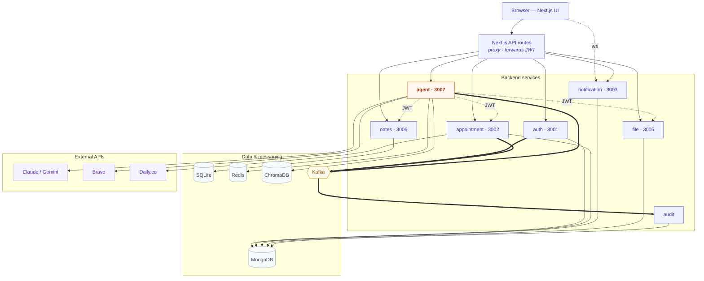

# Smart Healthcare Platform

A full-stack telehealth platform where doctors and patients book appointments, hold video
consultations, exchange clinical notes and files, and — new in the AI track — ask a **clinical
research agent** that answers questions grounded in the patient's own records.

Built as a microservices system: a **Next.js** frontend in front of **seven Node/Express
backend services**, wired together with **JWT auth**, **Kafka** events, and **Redis**.

> Built during the Arbisoft AI-Focused Internship 2026 (Weeks 1–4). The `frontend/README.md`
> covers the Week-1 UI in more depth; this file is the whole-system guide.

---

## Table of contents

- [Architecture](#architecture)
- [Services](#services)
- [Tech stack](#tech-stack)
- [Prerequisites](#prerequisites)
- [Setup](#setup)
- [Running the stack](#running-the-stack)
- [Environment variables](#environment-variables)
- [Testing](#testing)
- [Project layout](#project-layout)
- [Troubleshooting](#troubleshooting)

---

## Architecture

The browser only ever talks to the Next.js app. Next.js catch-all API routes
(`frontend/app/api/*`) proxy each call to the right backend service, forwarding the caller's
JWT. Services talk to each other over HTTP (forwarding that same JWT) and asynchronously over
Kafka; the audit-service is a pure Kafka consumer that persists an audit trail.

Edges: **solid** = HTTP request · **dotted** = internal call with the caller's JWT forwarded · **thick** = Kafka event.



## Services

| Service | Port | Data store | Responsibility |
|---|---|---|---|
| **auth** | 3001 | MongoDB | Registration, login, JWT issuance, roles (doctor / patient) |
| **appointment** | 3002 | MongoDB | Booking, status, Daily.co video rooms + meeting tokens |
| **notification** | 3003 | MongoDB | Email (nodemailer), real-time socket.io, cron reminders |
| **file** | 3005 | MongoDB | Patient file vault (uploads, sharing, doctor comments) |
| **notes** | 3006 | SQLite (Prisma) | Clinical notes + vitals; AI-draft "unreviewed → confirm" workflow |
| **agent** | 3007 | Redis + ChromaDB | Clinical research agent (ReAct loop, tools, streaming, RAG) |
| **audit** | — | MongoDB | Kafka consumer; persists an audit trail (no HTTP port) |

The **agent-service** is the AI centerpiece: a function-calling ReAct loop over Claude or
Gemini with tools for web search, reading patient files, fetching appointments, and RAG over
notes/PDFs. It forwards the caller's JWT to every sibling call (so it can never read data the
caller couldn't), publishes every tool call to Kafka for audit, scores answer confidence, and
scans untrusted text for prompt injection.

## Tech stack

- **Frontend:** Next.js 16 (App Router), TypeScript, Tailwind CSS v4, Recharts, Framer Motion, socket.io-client. Tests: Vitest + React Testing Library.
- **Backend:** Node.js + Express. Auth via JSON Web Tokens. Tests: Jest per service.
- **Data:** MongoDB (most services), SQLite via Prisma (notes), Redis (agent session memory), ChromaDB (optional vector recall).
- **Messaging:** Apache Kafka (events + audit trail).
- **AI:** Anthropic Claude or Google Gemini (the agent auto-detects from whichever key is set), Brave Search API, Voyage embeddings.

## Prerequisites

- **Node.js 20+** (developed on Node 24)
- **MongoDB** — local or a cloud cluster (Atlas)
- **Kafka** broker on `localhost:9092` (events + audit)
- **Redis** on `localhost:6379` — *optional*; the agent falls back to an in-process store if absent
- **ChromaDB** on `localhost:8000` — *optional*; only needed for the agent's RAG feature
- API keys — *optional but needed for the AI features*: an **Anthropic** or **Gemini** key for the agent, a **Brave** key for web search, a **Voyage** key for RAG.

## Setup

Each service is self-contained with its own `package.json`, so dependencies are installed
per service.

```bash
# 1. Install backend deps (repeat for each service + shared)
for s in auth appointment notification file notes agent audit; do
  (cd Backend/services/$s-service && npm install)
done
(cd Backend/shared && npm install)

# 2. Install frontend deps
cd frontend && npm install && cd ..

# 3. Configure env — copy each example and fill it in (see below)
#    Every service has its own .env.example.
cp Backend/services/auth-service/.env.example Backend/services/auth-service/.env
# ...repeat for each service...

# 4. notes-service only — create the local SQLite database
cd Backend/services/notes-service && npx prisma migrate dev && cd ../../..
```

> On Windows PowerShell, use `Copy-Item` instead of `cp`, or copy the files in Explorer.

## Running the stack

```bash
# Start all backend services in one terminal (color-coded logs, Ctrl+C stops all)
node Backend/dev.js

# ...or only the ones you name
node Backend/dev.js auth notes agent

# In a second terminal, start the frontend
cd frontend && npm run dev
```

Then open **http://localhost:3000**, register/login as a doctor or patient, and use the app.
The agent's "Ask" panel appears on the doctor dashboard.

## Environment variables

The two shared secrets **must be byte-for-byte identical across every service**, or tokens
minted by auth-service won't verify elsewhere:

- `JWT_SECRET` — signs and verifies all auth tokens
- `INTERNAL_SERVICE_TOKEN` — authenticates service-to-service calls

Generate a strong value with:

```bash
node -e "console.log(require('crypto').randomBytes(48).toString('base64url'))"
```

Other notable variables (see each service's `.env.example` for the full list):

| Variable | Service(s) | Purpose |
|---|---|---|
| `MONGO_URI` / `MONGODB_URI` | most | MongoDB connection string (use the standard, non-SRV form to avoid DNS TXT timeouts) |
| `DATABASE_URL` | notes | SQLite file path for Prisma |
| `KAFKA_BROKERS` | agent, others | Kafka broker list (default `localhost:9092`) |
| `DAILY_API_KEY` | appointment | Daily.co video room + token creation |
| `ANTHROPIC_API_KEY` / `GEMINI_API_KEY` | agent | LLM provider (auto-detected; set at least one for AI features) |
| `AGENT_MODEL` / `GEMINI_MODEL` | agent | Model id per provider |
| `BRAVE_API_KEY` | agent | Web-search tool |
| `VOYAGE_API_KEY` + `CHROMA_URL` | agent | RAG embeddings + vector store (optional) |
| `NEXT_PUBLIC_NOTIFICATION_SOCKET_URL` | frontend | Overrides the notification websocket host (needed for non-localhost deploys) |

> **Never commit a real `.env`.** The root `.gitignore` excludes all `.env` files, local
> SQLite databases, and `Backend/services/file-service/uploads/` (real patient documents).

## Testing

```bash
# Any backend service
cd Backend/services/agent-service && npm test

# Frontend
cd frontend && npm test        # Vitest
npx tsc --noEmit               # typecheck
npx eslint app components lib   # lint
```

Each backend service ships a Jest suite (the agent-service uses
`--experimental-vm-modules` for its ESM PDF dependency — already baked into its `npm test`).
The frontend uses Vitest + React Testing Library.

## Project layout

```
.
├── Backend/
│   ├── dev.js                 # runs every service in one terminal
│   ├── services/
│   │   ├── auth-service/
│   │   ├── appointment-service/
│   │   ├── notification-service/
│   │   ├── file-service/
│   │   ├── notes-service/     # Prisma + SQLite; AI note-review workflow
│   │   ├── agent-service/     # the clinical research agent
│   │   └── audit-service/     # Kafka consumer
│   └── shared/                # shared Kafka + Redis clients
└── frontend/
    ├── app/
    │   ├── (auth)/            # login, register
    │   ├── (dashboard)/       # doctor, patient, video call
    │   └── api/               # catch-all proxy routes to each service
    ├── components/            # UI incl. AgentPanel (streaming Ask panel)
    ├── contexts/ · lib/ · types/
    └── __tests__/
```

## Troubleshooting

- **`Dependencies are not installed for: <service>`** — `dev.js` refuses to start a service with no `node_modules`. Run `npm install` in that service directory.
- **`queryTxt ETIMEOUT` at boot** — a Mongo `mongodb+srv://` DNS lookup is timing out (common on some networks). Use the standard `mongodb://host1,host2,host3/...` connection string instead; the `.env.example` files explain how to build it.
- **Agent answers 401 / 403** — the agent-service `JWT_SECRET` doesn't match auth-service's. They must be identical.
- **Agent has no LLM** — set `ANTHROPIC_API_KEY` or `GEMINI_API_KEY` in `agent-service/.env`. If your Gemini account is new, older `gemini-2.5-*` models may be unavailable; set `GEMINI_MODEL` to a current one.
- **Notification bell never connects** — in any non-localhost deploy, set `NEXT_PUBLIC_NOTIFICATION_SOCKET_URL` to the notification service's public origin.
- **RAG errors** — the vector features need Docker ChromaDB on `:8000` and a `VOYAGE_API_KEY`. They're optional; the rest of the agent works without them.
